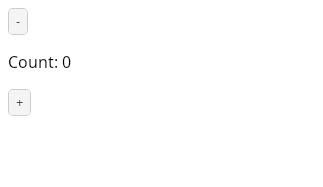
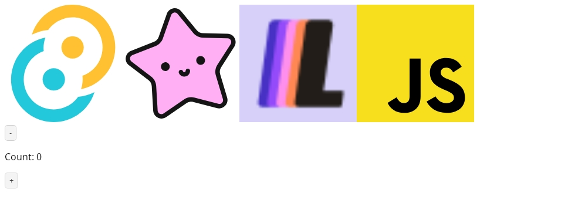
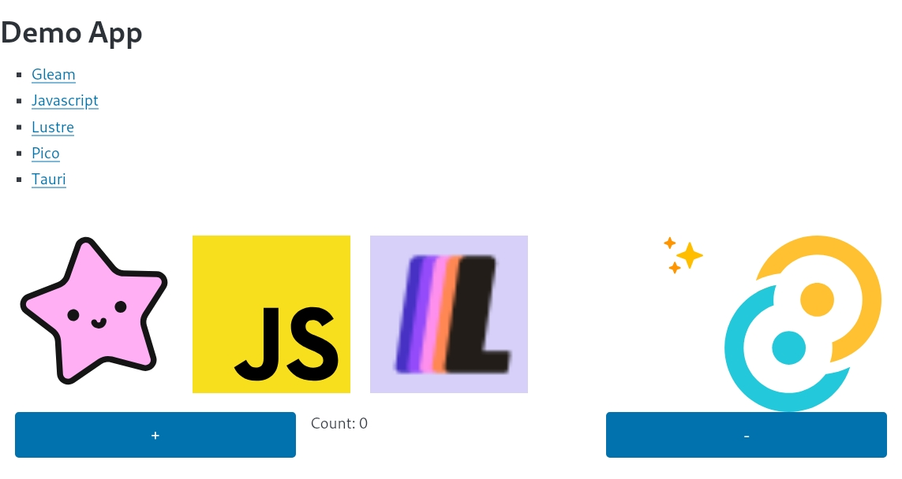

# Gleam Sample Apps

This started as set of sample apps illustrating how to configure Gleam + Lustre + Vite + Vite-Gleam + Tauri apps.
However, it has grown into a hodpodge of sample apps showing all the really interesting bits I need to build
commercial apps using gleam.

## quickstart

```
brew install mise
mise install
cd simple
pnpm install
pnpm tauri dev
```

## apps

### simple 

Instructions/example in ./simple.



### fancy

More involved example than simple in ./fancy that uses TailWind CSS.



### fancier

More involved example than fancy in ./fancier that uses Pico CSS.



### leaflet

How to use leafletjs.

### maplibregl

How to use mapblibre-gl... but something is broken here.

### fileupload

How to upload files to a webserver using mist.

### withcron

How to use the cron library.


