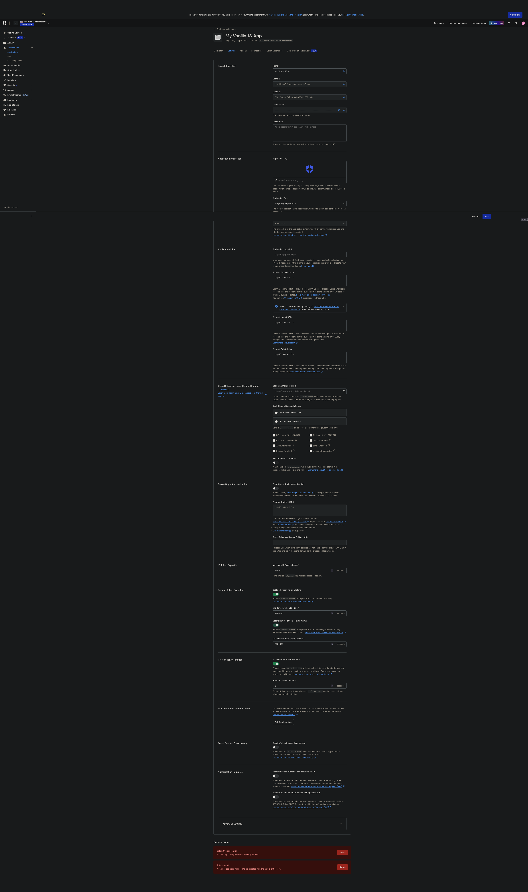

# app

This is a demo app showing how to use Auth0 + Vite + Gleam/Lustre.

## Config

### Auth0
The following Auth0 steps are just from memory, and may be a bit out of order.

* Go to [Auth0](https://auth0.com) and login to your account
* Create an SPA, API, Role, User
* Attach the API to your Application (SPA)
* Add the API to your role
* Add the role to your user
* Replace the config settings in [dev_auth0_config.mjs](src/dev_auth0_config.mjs) with those from your auth0 application

replace the settings in dev_auth0_config.mjs:

```rust
export const AUTH0_DOMAIN = "dev-h5fmk5o1opmoso6k.us.auth0.com"
export const AUTH0_CLIENT_ID = "D6C1PvwjotSxbAbLxAD06QrExP55vsKe"
export const AUTH0_APP_CALLBACK_URL = "http://localhost:5173/"
```

with your settings from your application (above)

```rust
export const AUTH0_DOMAIN = "YOUR AUTH0 DOMAIN"
export const AUTH0_CLIENT_ID = "YOUR AUTH0 CLIENT ID"
export const AUTH0_APP_CALLBACK_URL = "YOUR AUTH0_CALLBACK_URL"
```

For context, here's what the auth0 settings look like for this demo app (in my Auth0 account), note the Application URIs.




## Development

```sh
pnpm vite
```

## Discussion
https://discordapp.com/channels/768594524158427167/1457617569967243284/1457646774658269309