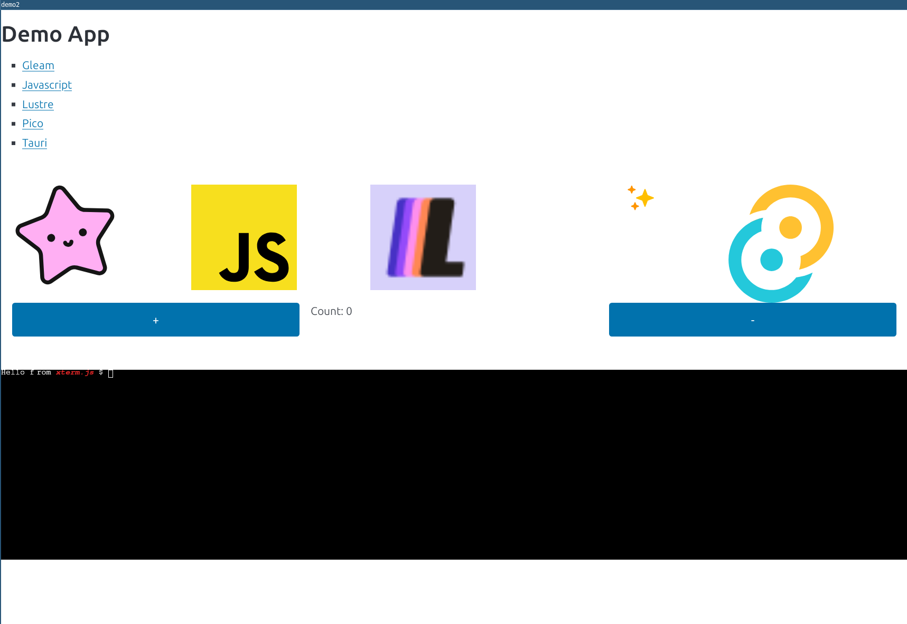

# embed xtermjs into an app

This is an example of how to configure:
* tauri
* gleam
* vite
* gleam-vite
* lustre
* xtermjs  <<<---- this is what's added on top of fancier

## quickstart

```
pnpm install
pnpm tauri dev
```

## image

the xterm doesn't do anything yet, but this shows xterm.js wired in:

* 


## steps
The log shows the steps made for configuring this app:

```
0ff8935 add lustre app
96304bd add vite-config
3554aa4 configure vite
d538b7c integrate vite
ae29b24 initial commit
```

## links
* https://vite.dev/guide/
* https://github.com/Enderchief/gleam-tools
* https://v2.tauri.app/start/create-project/
* https://github.com/lustre-labs/dev-tools/issues/42#issuecomment-2188482606

